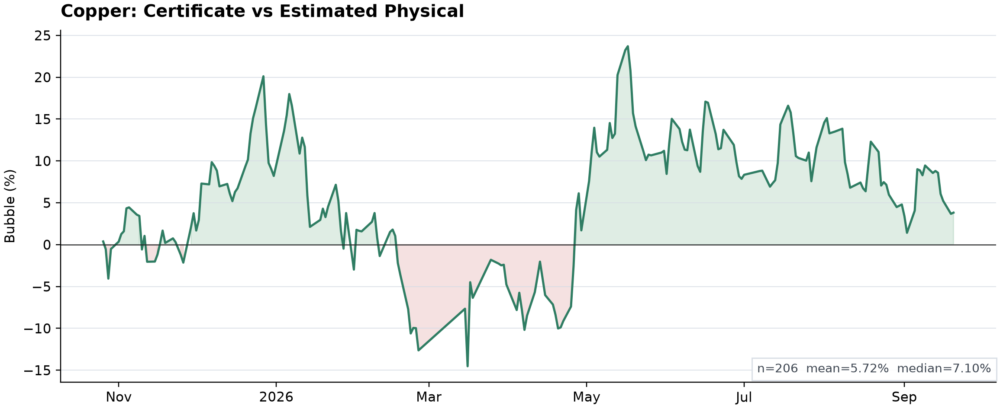
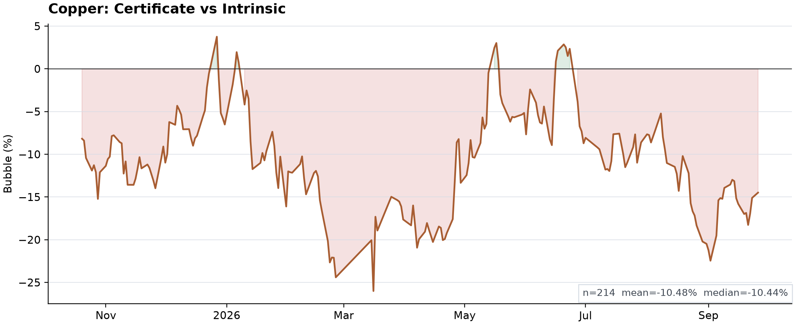
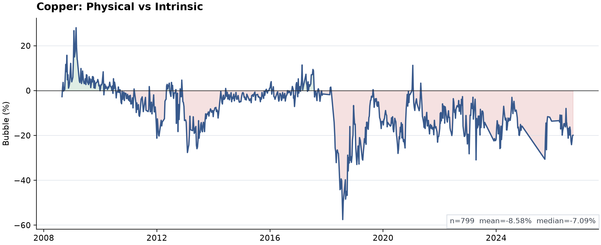

# Copper Certificate Valuation — Research Summary

**Mohammad Mahdi Amirabadi**

This report summarizes the current empirical result for the Iranian copper-cathode warehouse receipt. It is the visitor-facing research report; implementation checkpoints and source-refresh history remain in the project documentation.

## Research question

Does the Iranian copper-cathode warehouse receipt trade at a premium or discount to a comparable domestic physical-market value, after accounting for movements in LME cash copper and the free-market USD/IRR exchange rate?

## Data and benchmark construction

The analysis combines four inputs:

- Iran Mercantile Exchange warehouse-receipt prices;
- eligible domestic physical cathode trades from National Iranian Copper Industries Company;
- LME cash copper quotations; and
- the shared free-market USD/IRR history.

The domestic physical benchmark includes the approved NCI cathode symbols under cash and cash-matching contracts with positive executed price and quantity. Other producers, forward and credit contracts, and the separately identified “copper cathode 2” product are excluded from the primary comparable basket.

The transparent international reference is

```text
intrinsic_price_t = (LME_cash_USD_per_ton_t / 1000) × USD_IRR_t
```

LME and FX observations are aligned as-of using the latest value on or before the target date. On dates where certificate and comparable physical trades coexist, the physical-to-intrinsic ratio is observed. Between adjacent observed anchors, that ratio is interpolated in calendar time and multiplied by contemporaneous intrinsic value. The estimator does **not** extrapolate before the first or after the last observed anchor.

## Primary result

The current primary output contains **206 certificate-trading days** from 2025-10-26 through 2026-09-20. Of these, **36** are observed physical anchors and **170** use bounded interpolation between anchors.

The estimated certificate premium to comparable domestic physical value averages **5.73%**, with a median of **7.16%**.



Positive values indicate a certificate premium to the estimated comparable physical value; negative values indicate a discount. The uneven and relatively small physical-anchor sample is an important limitation of the estimate.

## Supporting comparisons

The project retains two separate supporting measures rather than folding them into the headline result.

### Certificate versus LME–FX intrinsic value



This comparison asks how the certificate trades relative to the international copper price translated at the free-market exchange rate. It is useful context, but it is not treated as a substitute for a domestic physical-market comparable.

### Domestic physical copper versus LME–FX intrinsic value



This comparison measures the domestic physical basis on observed eligible physical-trading dates. A certificate can therefore trade at a premium to domestic physical value while both markets remain below the simple LME–FX reference.

## Interpretation

The result is a historical relative-price estimate, not a guaranteed arbitrage or a real-time trading signal. The international reference is deliberately transparent rather than a complete import-parity model. Taxes, transport, storage, financing, delivery conditions, quality differences, liquidity, capital controls, and other institutional frictions may contribute to the observed domestic basis.

The interpolation also uses the next observed physical anchor when estimating dates between two anchors. The resulting series is suitable for historical measurement but is **not** a look-ahead-free backtest signal.

## Reproducibility

The production workflow keeps certificate trades, physical trades, international inputs, and derived valuation tables separate. Raw source evidence is preserved outside Git under the repository’s data-governance policy; versioned code rebuilds the approved benchmark and comparisons.

From the repository root:

```bash
python commodity/copper/refresh_powerbi.py
python reports/copper/research/build_figures.py
```

Add `--collect` to the first command when a source refresh is explicitly required.

For full sample construction, source contracts, validation rules, current coverage, and research-status history, see the [Copper project README](../../../commodity/copper/README.md), [workflow](../../../commodity/copper/docs/WORKFLOW.md), and [output ownership](../../../commodity/copper/docs/OUTPUTS.md).

The LaTeX source in this directory is retained as a typeset report source. Numerical claims on this page follow the current project checkpoint rather than older report vintages.
