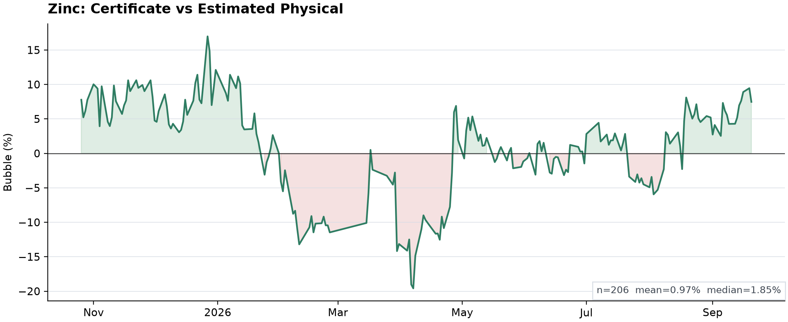
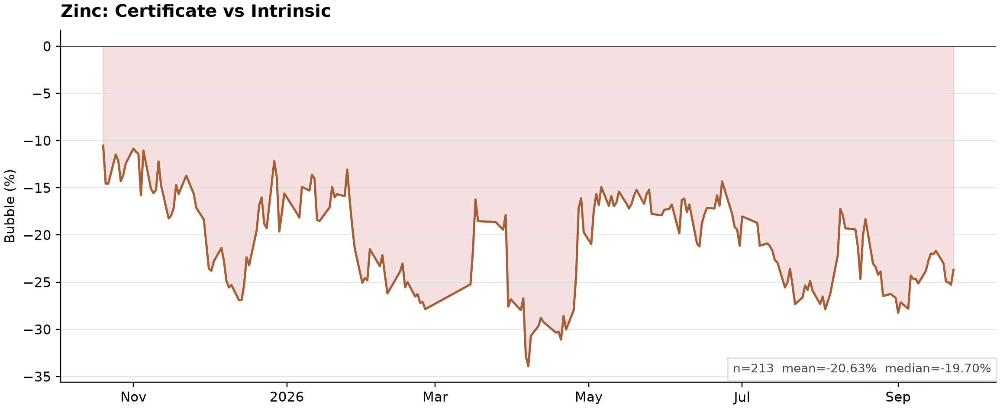
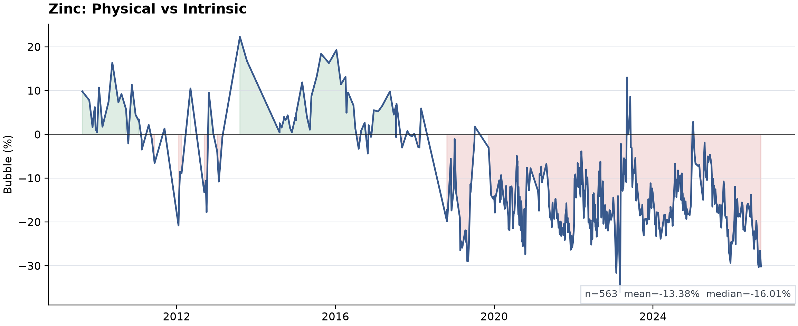

# Zinc Certificate Valuation — Research Summary

**Mohammad Mahdi Amirabadi**

This report summarizes the current empirical result for the Iranian zinc-ingot warehouse receipt. It is the visitor-facing research report; operational checkpoints and earlier report vintages remain in the project documentation.

## Research question

How does the Iranian zinc-ingot warehouse receipt trade relative to an eligible domestic physical basket and to an LME–FX intrinsic benchmark?

## Data and comparable underlying

The analysis combines:

- Iran Mercantile Exchange warehouse-receipt prices;
- domestic physical zinc trades;
- LME cash zinc quotations; and
- the shared free-market USD/IRR history.

The broad raw physical dataset intentionally retains both zinc ingot and zinc soil for auditability, but zinc soil is economically distinct and does not enter the benchmark. The approved comparable underlying is a volume-weighted daily basket of **99.97 and 99.98 zinc ingots** traded through cash or cash-matching contracts with positive executed price and quantity.

The transparent international reference is

```text
intrinsic_price_t = (LME_cash_USD_per_ton_t / 1000) × USD_IRR_t
```

The project reports three measures separately: domestic physical value versus intrinsic value, certificate value versus intrinsic value, and certificate value versus estimated comparable domestic physical value.

## Primary estimator

On dates where comparable physical and certificate trades coexist, the physical-to-intrinsic ratio is observed. Between adjacent anchors, the ratio is interpolated in calendar time and multiplied by contemporaneous intrinsic value. No extrapolation is used outside the observed anchor range.

This design preserves movements in LME zinc and USD/IRR while allowing the domestic physical basis to differ persistently from the simple international reference.

## Primary result

The current primary output contains **206 modeled certificate days** from 2025-10-26 through 2026-09-20. It contains **50 observed anchors** and **156 bounded interpolations**.

The certificate premium to estimated domestic physical value averages **0.80%**. By contrast, the direct certificate-to-LME–FX comparison shows an average **20.54% discount**.



The contrast is economically important: a large discount to the international reference does not imply an equally large discount relative to the domestic physical market. Much of the direct LME–FX gap reflects the domestic physical basis itself.

## Supporting comparisons

### Certificate versus LME–FX intrinsic value



This series measures the certificate directly against the international zinc price translated at free-market FX. It is a transparent benchmark, not a complete domestic parity value.

### Domestic physical zinc versus LME–FX intrinsic value



This series shows the basis of the eligible domestic 99.97/99.98 ingot basket relative to the same international factor. It provides the economic context required to interpret the certificate correctly.

## Interpretation

The primary result suggests that, once the domestic physical basis is incorporated, the warehouse receipt is much closer to its comparable domestic market value than a direct LME–FX comparison would imply.

The estimate remains subject to important limitations. Physical anchors are sparse and uneven over time; the approved basket can still contain producer, warehouse, delivery, and quality differences; and the international factor omits taxes, logistics, financing, storage, liquidity, and institutional frictions.

Because bounded interpolation uses the next observed anchor for dates between anchors, the historical series is **not** a look-ahead-free trading signal or backtest.

## Reproducibility

Certificate trades, broad physical-market data, the approved physical benchmark, international inputs, and derived valuation outputs remain distinct throughout the pipeline. Versioned tests cover source contracts, benchmark rules, alignment, bubble formulas, anchor reconstruction, and no-extrapolation behavior.

From the repository root:

```bash
python commodity/zinc/refresh_powerbi.py
python reports/zinc/research/build_figures.py
```

Add `--collect` to the first command when source refresh is explicitly required.

For full methodology, sample construction, validation rules, and current coverage, see the [Zinc project README](../../../commodity/zinc/README.md) and [workflow](../../../commodity/zinc/docs/WORKFLOW.md).

The LaTeX source in this directory is retained as an earlier typeset research-report source. Its numerical checkpoint predates the current September production refresh; use this Markdown report and the project README for current headline results.
